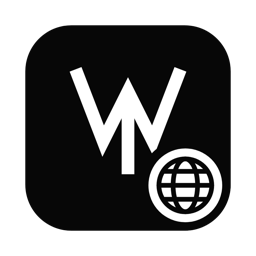

<div align="center">



# Weald Relay Host

**Your own Weald relay, running on your Mac, in one click.**

A status bar app. Start the relay, copy the URL, paste it into Weald.
That is the whole product.

<sub>macOS 14+ · Apple silicon and Intel · Apache 2.0 · v0.2.0</sub>

</div>

---

## Why

A Weald workspace talks to a relay. The relay stores and forwards sealed
envelopes it cannot read, so hosting it yourself is not a security upgrade,
it is a control one: your box, your uptime, your data at rest, no account
anywhere. This app makes that a menu bar toggle instead of an afternoon
with Docker Compose.

## Install

**1. Install a Docker engine.**
[Docker Desktop](https://www.docker.com/products/docker-desktop/) or
[OrbStack](https://orbstack.dev). Open it once so the engine is running.
It is the only prerequisite, and the app links you to it if it is missing.

**2. Build and install the app.**

```bash
git clone https://github.com/Weald-Protocol/weald-relay-host.git
cd weald-relay-host
./scripts/build-app.sh
open build
```

Drag **Weald Relay Host.app** into `/Applications` and launch it. A white
**W** appears in your menu bar.

**3. Click the W, then Start relay.**

The first start pulls the relay image and runs its migrations, so give it a
minute. After that it is a few seconds. Green dot means the socket answers.

**4. Copy the URL into Weald.**

```
ws://127.0.0.1:54040/relay
```

Click the URL row to copy it. In the Weald Mac app, open your project's
relay settings and paste.

**5. Claim the workspace.**

A brand new relay has no members, so it mints a one-time invite. The panel
shows it as **First device link** and **One-time code**. Open the link from
Weald and that device becomes the workspace owner.

Copy the code somewhere safe first. It is minted once and the relay keeps
only a hash of it, so it cannot be shown again. If you lose it, erase stored
data in Settings and start over.

## The panel

| | |
| --- | --- |
| **Status** | Green means the socket answers. An actual health check, not a container guess. |
| **This Mac** | `ws://127.0.0.1:54040/relay`. Click to copy. |
| **Public address** | Your public IP with the same port, for devices that are not this Mac. |
| **First device link** | Only while the workspace has no members. |
| **Port** | 54040 by default. Change it, then Apply and restart. |
| **Image tag** | `auto` runs the newest published release. Type a tag to pin one. |
| **Start at login** | Brings the relay back after a reboot. |
| **Erase stored data** | Deletes the relay's database and blobs. |

## Reaching it from another machine

The public address row shows where the outside world would reach you. Two
things stand between that line and a working connection, and both are yours
to open.

**TLS.** Weald clients refuse a plaintext socket to anything that is not
literally loopback, which is why `ws://` works on this Mac and nowhere else.
Put a TLS front door on the port and hand out the `wss://` URL instead. A
Cloudflare Tunnel or a Tailscale HTTPS hostname does this in a couple of
minutes and needs no port forwarding at all.

**Your router.** If you would rather expose the port directly, forward it to
this Mac and expect the IP to move whenever your ISP feels like it.

The short honest answer: use a tunnel, not the raw IP.

## What is actually running

A compose project named `weald-relay-host`:

- `ghcr.io/weald-protocol/wealdrelay`, the published relay image
- `postgres:16-alpine`, its database
- one `alpine` container that lives for a second on first start, because the
  relay image is distroless and runs as uid 65532 with no shell, so it cannot
  take ownership of a fresh volume itself

Nothing long-lived beyond the first two. The compose file is regenerated at
every start, so it always matches the port and tag in the panel:

```
~/Library/Application Support/WealdRelayHost/compose.yml
```

Encrypted media blobs go to a Docker volume rather than S3, which the relay
supports for single node installs. Redis is omitted, so the relay uses
in-process fanout.

## What the relay can see

Nothing. It stores and forwards envelopes it cannot read. There is no admin
password, no operator account and no web admin panel, because there is
nothing an operator could usefully administer. Workspace administration
happens in the client, signed by a device that holds `admit`.

An operator who is not a workspace member has exactly two powers: keep the
service running, and stop keeping it running.

## Troubleshooting

**"Docker is not running."** Open Docker Desktop or OrbStack and wait for it
to finish starting.

**"That port is taken."** Something else holds 54040. Change the port in
Settings, then Apply and restart.

**Green dot, but Weald will not connect.** Check that the URL is `ws://` and
not `wss://` for a local relay, and that the port matches.

**Raw logs.**

```bash
docker compose -f ~/Library/Application\ Support/WealdRelayHost/compose.yml logs -f relay
```

## Development

```bash
swift build                    # iterate
./scripts/build-app.sh         # universal, ad-hoc signed .app in build/
node scripts/render-icon.mjs   # regenerate Resources/AppIcon.icns from icon.svg
```

No dependencies beyond the Swift toolchain. The bundle is assembled by the
script rather than Xcode because a status bar app needs `LSUIElement`, and
that is the only thing Xcode would have added.

The app icon is the Weald mark with a globe badge, drawn in
`Resources/icon.svg` and rendered to `.icns` by the script above.

## License

Apache License 2.0. The relay it runs is Apache 2.0 too, and its source is at
[Weald-Protocol/wealdrelay](https://github.com/Weald-Protocol/wealdrelay).
